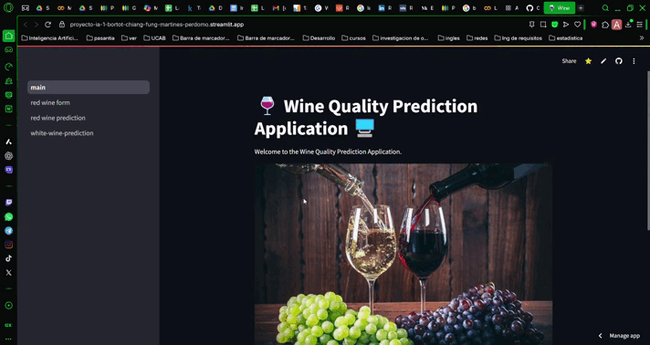

<div align="center">
  
</div>

# First Project AI

# 🍷 Wine Quality Prediction Application 🖥️

<div align="center">
  
</div>

This repository contains the details of the Unity game

## Contents

### 🎯 Objective

Develop a graphical user interface (GUI) application that allows a user to input the physicochemical parameters of a wine and obtain a prediction of its quality — both as a numerical score and a qualitative category — using a Machine Learning model. An essential requirement of the application is its ability to handle missing input values gracefully. 🤖

### 📊 Dataset

_Wine Quality Dataset_ (available at the [UCI Machine Learning Repository](https://archive.ics.uci.edu/ml/datasets/Wine+Quality)). This dataset contains physicochemical measurements of wines, including:

- **Fixed Acidity**
- **Volatile Acidity**
- **Citric Acid**
- **Residual Sugar**
- **Chlorides**
- **Free Sulfur Dioxide**
- **Total Sulfur Dioxide**
- **Density**
- **pH**
- **Sulphates**
- **Alcohol**

and a quality rating (ranging from 0 to 10). 📈

### ❓ The Missing Data Challenge

Although the standard Wine Quality Dataset does not include missing values, in real-world scenarios it is very likely that some physicochemical measurements may be absent when evaluating a wine. Therefore, a fundamental aspect of this application is its capacity to manage the absence of one or more input values provided by the user. 🤷‍♂️

## Requirements

- Python
- Dataset: The dataset was provided in the following link [Wine Quality](https://archive.ics.uci.edu/dataset/186/wine+quality)

## Installation

1. Clone the project on your computer:

   ```bash
   git clone https://github.com/C102002/proyecto-ia-1
   ```

>[!NOTE]  
> Python Version 3.11 🚀:
> - **Dependency Compatibility:** Using **Python 3.11** helps resolve known issues with data analysis and dependency conflicts with libraries like **Keras** and **TensorFlow**. ⚙️  
> - **Bug Fixes & Stability:** This version includes essential fixes and improvements that enhance overall stability, ensuring smoother execution of your ML workflows. 🐛✅  
> - **Optimized Performance:** With core runtime improvements, Python 3.11 delivers faster execution and better resource management during data processing and model training. ⚡💻  
>  
> Adopting Python 3.11 is crucial for building robust, efficient applications in data science and deep learning.


2. Create the Python virtual environment

   ```bash
   # Run the following command to create a virtual environment in the project directory:
   py -3.11 -m venv venv  
   ```

3. Activate the virtual environment

   ```bash
   # Windows (using Command Prompt):
   venv\Scripts\activate

   # Windows (using PowerShell):
   .\venv\Scripts\activate.ps1

   # macOS and Linux:
   source venv/bin/activate
   ```

4. Install the dependencies

   ```bash
   # Run the following command:
   pip install -r requirements.txt
   ```

5. Update dependencies

   ```bash
   # Run the following command to update the requirements file:
   pip freeze > requirements.txt
   ```

6. Deploy the app

```bash
streamlit run .\app\main.py
```

```bash
# It appears something like this
(venv) PS C:\your-path> streamlit run .\app\main.py

You can now view your Streamlit app in your browser.

Local URL: http://localhost:8501
Network URL: http://192.168.1.1.:8501

 ```

7. Example of the App



8. Models 🍷

Explore our interactive notebooks that showcase our modeling approaches for both red and white wine datasets. These notebooks provide a step-by-step guide through data preprocessing, feature engineering, and advanced regression techniques.

- **Red Wine Model** 🍇  
  [View the Red Wine Model Notebook](https://colab.research.google.com/drive/1a6zimMAp0suVrvqITeM1gKycN_lvJIs7?usp=sharing)

- **White Wine Model** 🍾  
  [View the White Wine Model Notebook](https://colab.research.google.com/drive/1v7tvhFsM7H9Te2CMSmm7W8I6mwn6c666?authuser=2)


## Contributions

<table align="center">
    <tbody>
        <tr>
            <td align="center">
                <a href="https://github.com/Fussita" rel="nofollow">
                    
                    <br>
                    <sub><b>Hualong Chiang</b></sub>
                </a>
                <br>
                <a href="" title="Commits">
                    <g-emoji class="g-emoji" alias="book" fallback-src="https://github.githubassets.com/images/icons/emoji/unicode/1f4d6.png">📖</g-emoji>
                </a>
            </td>
            <td align="center">
                <a href="https://github.com/C102002" rel="nofollow">
                    
                    <br>
                    <sub><b>Alfredo Fung</b></sub>
                </a>
                <br>
                <a href="" title="Commits">
                    <g-emoji class="g-emoji" alias="book" fallback-src="https://github.githubassets.com/images/icons/emoji/unicode/1f4d6.png">📖</g-emoji>
                </a>
            </td>
            <td align="center">
                <a href="https://github.com/DanielBortot" rel="nofollow">
                    
                    <br>
                    <sub><b>Daniel Bortot</b></sub>
                </a>
                <br>
                <a href="" title="Commits">
                    <g-emoji class="g-emoji" alias="book" fallback-src="https://github.githubassets.com/images/icons/emoji/unicode/1f4d6.png">📖</g-emoji>
                </a>
            </td>
            <!-- add other members -->
            <td align="center">
                <a href="https://github.com/juanpj17" rel="nofollow">
                    
                    <br>
                    <sub><b> Juan Perdomo</b></sub>
                </a>
                <br>
                <a href="" title="Commits">
                    <g-emoji class="g-emoji" alias="book" fallback-src="https://github.githubassets.com/images/icons/emoji/unicode/1f4d6.png">📖</g-emoji>
                </a>
            </td>
            <td align="center">
                <a href="https://github.com/Gamartinez25" rel="nofollow">
                    
                    <br>
                    <sub><b> Gabriela Martinez</b></sub>
                </a>
                <br>
                <a href="" title="Commits">
                    <g-emoji class="g-emoji" alias="book" fallback-src="https://github.githubassets.com/images/icons/emoji/unicode/1f4d6.png">📖</g-emoji>
                </a>
            </td>
        </tr>
    </tbody>
</table>

## License

This project is under Apache license. See the [LICENSE](LICENSE) file for more details.

## Deployment

https://proyecto-ia-1-bortot-chiang-fung-martines-perdomo.streamlit.app
